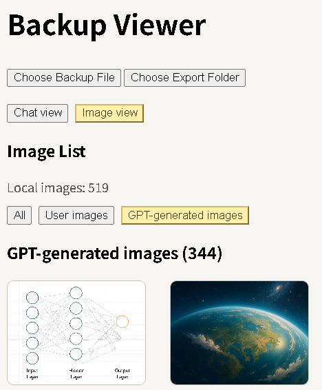
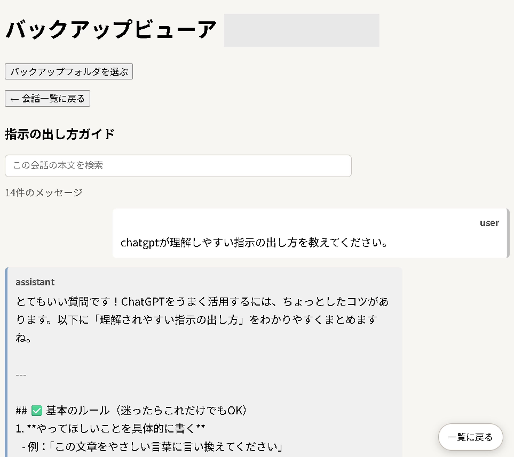

# ChatGPT JSON Viewer

A lightweight viewer for ChatGPT export data.

This tool reads your `conversations.json` file and lets you browse your conversations and images directly in your browser, with a dedicated image gallery view.

- Browse all images included in your export  
- Designed for easy browsing, even with large exports

---

## 🌐 Live Demo

* Japanese: [https://cocoa0620.github.io/chatgpt-json-viewer/](https://cocoa0620.github.io/chatgpt-json-viewer/)
* English: [https://cocoa0620.github.io/chatgpt-json-viewer/index_en.html](https://cocoa0620.github.io/chatgpt-json-viewer/index_en.html)

---

## 🚀 How to use

1. Export your data from ChatGPT
   (Settings → Data Controls → Export)

2. Download the ZIP file from the email

3. Unzip the file

4. Open the viewer and select:

   * `conversations.json`
   * your unzipped export folder

---

## ✨ Features

### 💬 Chat View

* Conversation list
* Full text view
* Search (list & content)
* Pin conversations
* Conversation size indicator

### 🖼 Image View

* Browse all images included in your export
Designed for easy browsing even with large exports.
* Separate views for:

  * User images
  * GPT-generated images
* Quick filter:

  * All / User / GPT-generated
* Thumbnail grid with click-to-expand
* Supports PNG, JPG, WEBP, and GIF

---

---

## 📸 Screenshots

### Image View

### List view

### Detail view

---

---

## 📝 Notes

* Works entirely in your browser (no data upload)

* Requires selecting both:

  * `conversations.json`
  * unzipped export folder

* Image-to-chat mapping is not fully reconstructed
  (images are shown in a separate gallery view for better usability)

---

## 🔒 Privacy

This tool runs entirely in your browser.

* No data is uploaded
* No server communication
* Your files stay on your device

---

## 💡 Why Image View?

ChatGPT export data does not always provide a reliable link between messages and image files.

Instead of forcing incomplete reconstruction, this tool provides a dedicated image gallery for easier browsing.

